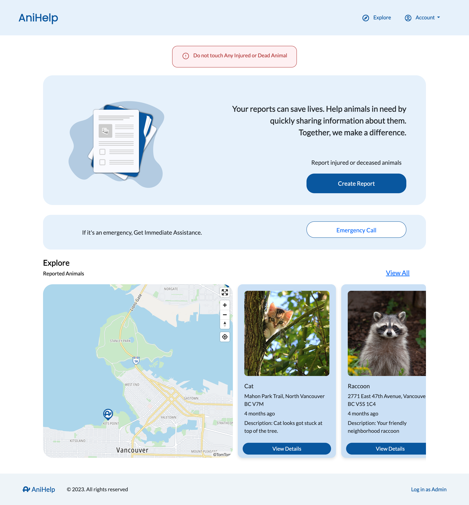

# AniHelp: First Group Project

## Welcome to AniHelp!

Welcome to "AniHelp" – our first group project. We, a team of 4 developers and 4 designers, collaborated to create this helpful web app. AniHelp facilitates reporting of injured animals to organizations by providing location, pictures, and a form with incident details.

## Purpose

AniHelp helps organizations efficiently manage inquiries in one platform. Additionally, it allows users to easily create reports for the correct organization, selecting ones closest and most specialized for the type of animal involved.

## Technologies Used

### Front End:
- HTML
- CSS
- JavaScript
- Sass
- Bootstrap

### Back End:
- Node.js
- Firebase
- TomTom API

## Features Implemented 

- Responsive design ensuring compatibility across devices
- Location services integration with TomTom API for enhanced user experience
- Database and authentication solutions applied
- Implementation of complex JavaScript functions for better solutions
- Bootstrap and Sass used for better UX and easy style management

## How to Run

To view the website locally, follow these steps:

1. Clone this repository to your local machine.

2. Navigate to the project directory.

3. Update database API details with your firebase API

4. Open the `index.html` file in your web browser.

5. You can now interact with the website locally in your browser.

## Program Walk-through

- Please check out our website [Here](https://anihelp-floor38.firebaseapp.com)
- And our Presentation [Here](./AniHelp-Presentation.pdf)

## Image Credits

We would like to thank the following photographers and platforms for providing the images used in the reports:

- Pixabay: [Link](https://www.pexels.com/photo/black-deer-lying-on-plants-near-green-trees-during-daytime-76972/)
- Pixabay: [Link](https://www.pexels.com/photo/brown-bear-on-a-body-of-water-158109/)
- Jan Kopczyński: [Link](https://www.pexels.com/photo/cute-dog-sitting-on-wood-log-in-forest-16271644/)
- Niklas Jeromin: [Link](https://www.pexels.com/photo/brown-deer-standing-on-brown-soil-3832008/)
- Yana Kangal: [Link](https://www.pexels.com/photo/cat-lying-down-on-blanket-on-beach-17459297/)
- Nicky Pe: [Link](https://www.pexels.com/photo/photo-of-a-cougar-near-a-log-7598287/)
- Skyler Ewing: [Link](https://www.pexels.com/photo/adorable-chipmunk-with-peanut-in-nature-5627781/)
- Andrey Yudkin: [Link](https://www.pexels.com/photo/raccoon-standing-on-fallen-leaves-9179705/)
- Steve: [Link](https://www.pexels.com/photo/grey-and-white-wolf-selective-focus-photography-682361/)
- Pranavsinh Suratia: [Link](https://www.pexels.com/photo/close-up-shot-of-a-bat-12019751/)
- Esteban Arango: [Link](https://www.pexels.com/photo/coyote-lying-on-grass-10226903/)
- Jean van der Meulen: [Link](https://www.pexels.com/photo/close-up-photo-of-owl-with-one-eye-open-1564839/)
- Aa Dil: [Link](https://www.pexels.com/photo/close-up-photo-of-owl-2474014/)
- Jean van der Meulen: [Link](https://www.pexels.com/photo/portrait-photo-of-brown-and-gray-bird-1526410/)
- Ana Pereira: [Link](https://www.pexels.com/photo/close-up-of-goose-17993136/)
- Osmany Mederos: [Link](https://www.pexels.com/photo/crow-walking-on-grass-ground-16057123/)
- Erik Karits: [Link](https://www.pexels.com/photo/black-bearded-dragon-on-green-grass-3820309/)
- Macro Photography: [Link](https://www.pexels.com/photo/frog-hiding-from-rain-under-a-leaf-12569708/)
- Silvana Palacios: [Link](https://www.pexels.com/photo/black-and-white-whale-jumping-on-water-3635870/)
- Guillaume Hankenne: [Link](https://www.pexels.com/photo/gray-dolphin-on-body-of-water-1986374/)
- Skitterphoto: [Link](https://www.pexels.com/photo/sea-animal-dog-zoo-23087/)

